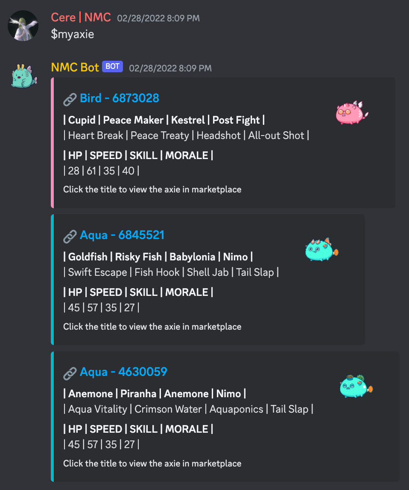
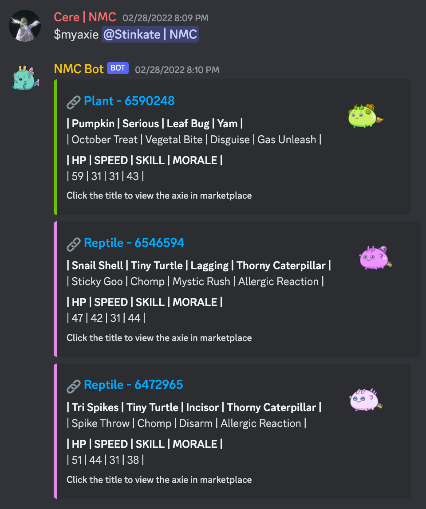
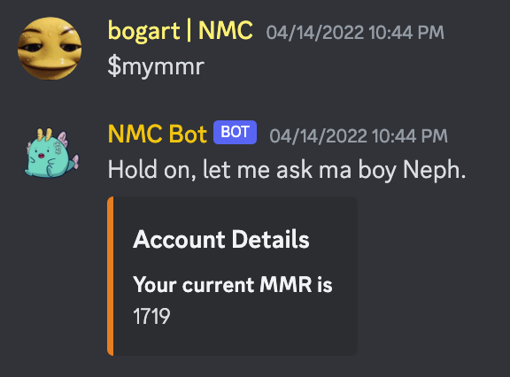
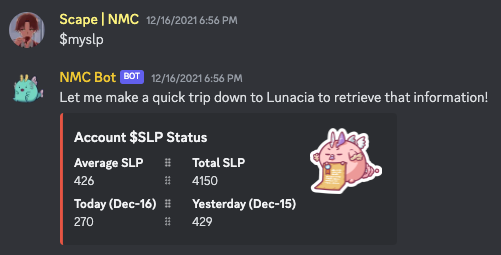
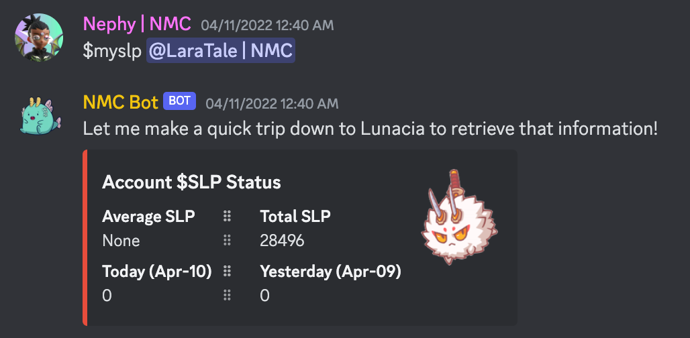
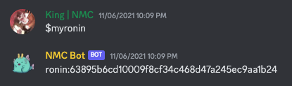
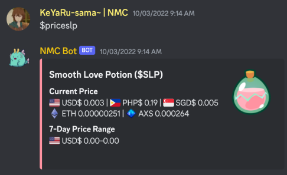
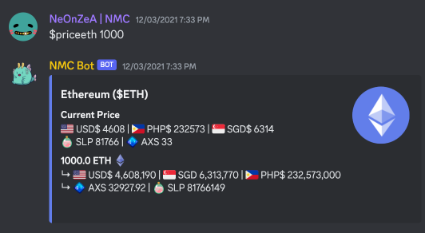
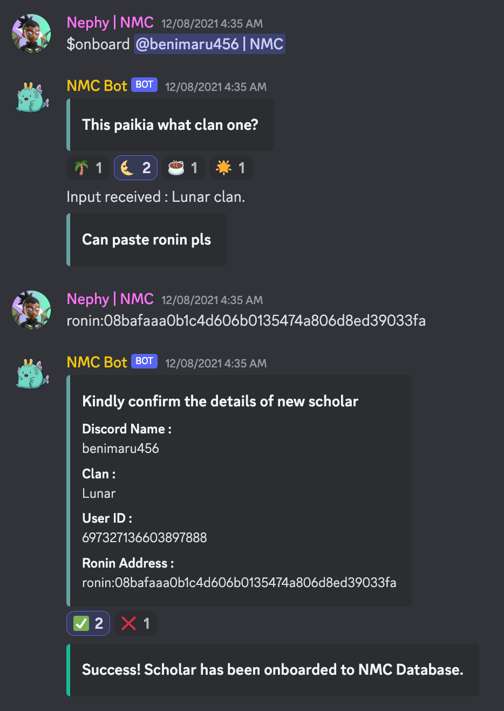

> **This repository is outdated and no longer in use as of 2022.**

# Axie Infinity Discord Bot (NMC)

The Axie Infinity Discord Bot is a tool designed specifically for managing users & managers within an Axie Infinity guild - Nox Moon Cardinal (NMC). 
This bot provides a sets of commands tailored to Axie Infinity players, enabling them to easily access information related to their Axies, Matchmaking Rating (MMR), Smooth Love Potion amount (SLP), marketplace links (and more!) directly within the Discord server.

This bot had been maintained by the owners of NMC guild - [@njh18](https://github.com/njh18) and [@nephydecode](https://github.com/nephydecode), previously deployed on [replit](https://replit.com/@njh18/Loops-practice#main.py).

Join our [Discord](https://discord.gg/cpPtxMRct3)!

## 🤖 Bot Commands

> Check out the ['bot-commands' channel](https://discord.com/channels/890225444190842881/914463230708027453) in our Discord that was previously used to send commands to the bot

* [List of Commands](#commands)
* [Commands Usage Example](#example)

### List of Commands 

#### Player Axie & Statistics Commands 🎮
* `$myaxie`: Get information about your Axies.
* `$myaxie <@user>`: Get information about the Axies of the tagged user.
* `$mymmr`: Get your MMR (Matchmaking Rating).
* `$myslp`: Get information about your SLP earnings (today's, yesterday's, average, total account)
* `$myscholarronin`: Get your scholar account's Ronin wallet information.
* `$myronin`: Get your Ronin wallet information (if you have manager permissions).

#### Price Information Commands 💰
* `$priceslp`: Get the exchange rate of SLP (Smooth Love Potion) to USD (United States Dollar) and PHP (Philippine Peso).
* `$priceslp <amt>`: Get the exchange rate of a specified amount of SLP to USD and PHP.
*Note: The commands prefixed with $price (e.g., $priceaxs, $pricephp, $priceusd, $pricesgd) also work similarly to $priceslp, providing exchange rates for different currencies.*

#### Admin / Manager Commands 🗃️
* `$myslp <@user>`: Get SLP earnings information of tagged user 
* `$clanslp <Lunar/Sol/Kopi/Oasis>`: Get entire clan's slp & mmr 
* `$onboard <@user>`: Follow process to upload user to database
* `$dbupdate`: Database update (to run after onboarding)
* `$leaderboard <rank,axieCount>`: Get axies used by leaderboard

### Example 

| Command            | Screenshot                                    |
|--------------------|-----------------------------------------------|
| `$myaxie`          |  |
| `$myaxie <@user>`  |  |
| `$mymmr`          |  |
| `$myslp`          |  |
| `$myslp <@user>`  |  |
| `$myronin`  |  |
| `$priceslp`  |  |
| `$priceeth`  |  |
| `$onboard <@user>`  |  |

## Usage
Simply type the desired command in the Discord server's chat and the bot will respond accordingly with the requested information.

## Acknowledgements
The Axie Infinity Discord Bot relies on the Discord API, pycoingecko API, and Axie Infinity API.