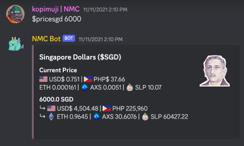
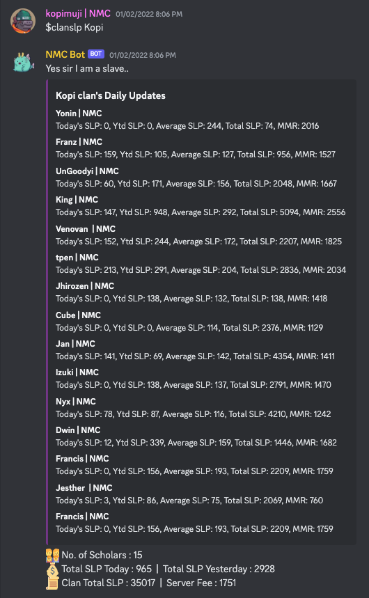
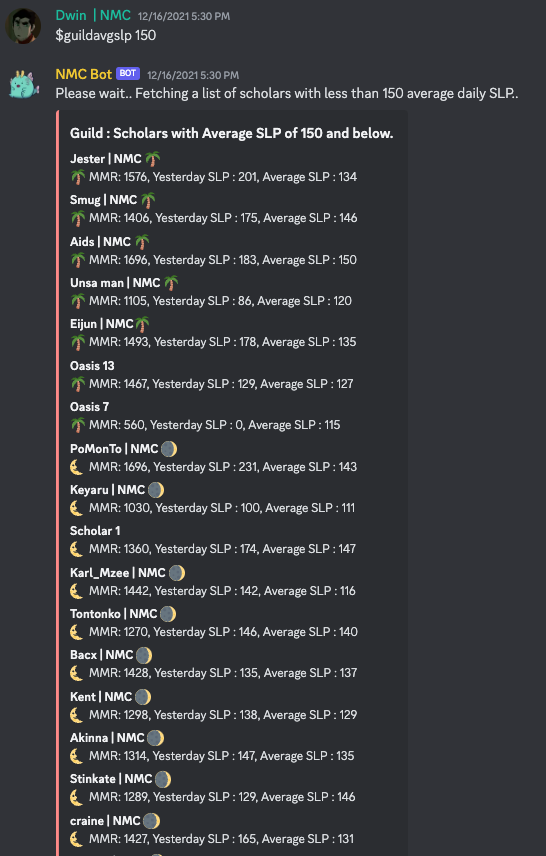

> ⚠️ This project is no longer maintained, updated, and its functionality may be deprecated.

# Axie Infinity Discord Bot (NMC)

## Overview
[Axie Infinity](https://axieinfinity.com/) is a blockchain-based digital pet universe where players collect, breed, and battle fantasy creatures called Axies.

The Axie Infinity Discord Bot is a tool designed for managing users & managers for an Axie Infinity guild - Nox Moon Cardinal (NMC). This bot provides a sets of commands tailored to Axie Infinity players, enabling them to easily access information related to their Axies, Matchmaking Rating (MMR), Smooth Love Potion amount (SLP), marketplace links (and more!) directly within the Discord server.

Join our [Discord](https://discord.gg/cpPtxMRct3)!

## 🤖 Bot Features - Commands

> Check out the ['bot-commands' channel](https://discord.com/channels/890225444190842881/914463230708027453) in our Discord that was previously used to send commands to the bot

* [List of Commands](#commands)
* [Commands Usage Example](#example)

#### Player Axie & Statistics Commands 🎮
* `$myaxie`: Get information about your Axies.
* `$myaxie <@user>`: Get information about the Axies of the tagged user.
* `$mymmr`: Get your MMR (Matchmaking Rating).
* `$myslp`: Get information about your SLP earnings (today's, yesterday's, average, total account)
* `$myscholarronin`: Get your scholar account's Ronin wallet information.
* `$myronin`: Get your Ronin wallet information (if you have manager permissions).

#### Price Information Commands 💰
* `$priceslp`: Get the exchange rate of SLP (Smooth Love Potion) to USD (United States Dollar) and PHP (Philippine Peso).
* `$priceslp <amt>`: Get the exchange rate of a specified amount of SLP to USD and PHP.
*Note: The commands prefixed with $price (e.g., $priceaxs, $pricephp, $priceusd, $pricesgd) also work similarly to $priceslp, providing exchange rates for different currencies.*

#### Admin / Manager Commands 🗃️
* `$myslp <@user>`: Get SLP earnings information of tagged user 
* `$clanslp <Lunar/Sol/Kopi/Oasis>`: Get entire clan's slp & mmr 
* `$guildavgslp`: Get list of players who has less than average daily 150 $SLP earned
* `$onboard <@user>`: Follow process to upload user to database
* `$dbupdate`: Database update (to run after onboarding)
* `$leaderboard <rank,axieCount>`: Get axies used by leaderboard

#### Screenshots of usage 

| Command            | Screenshot                                               |
|--------------------|----------------------------------------------------------|
| `$myaxie`          |       |
| `$myaxie <@user>`  |  |
| `$mymmr`           |        |
| `$myslp`           |        |
| `$myslp <@user>`   |   |
| `$myronin`         |      |
| `$priceslp <amt>`  |     |
| `$priceeth <amt>`  |     |
| `$pricesgd <amt>`  |     |
| `$onboard`         |      |
| `$clanslp`         |      |
| `$guildavgslp`     |  |

## Usage
Simply type the desired command in the Discord server's chat and the bot will respond accordingly with the requested information! Note that some 

## Motivation
This discord bot stemmed from the necessity to better manage players within the guild. As avid players ourselves, we recognised the importance of providing a seamless experience for our community members (players & managers alike) to access relevant information & foster a sense of community within our server! We aimed to straemline processes, tracked performance, promote healthy competition & ultimately enhance everyone's experience! 🍻

## Future Enhancements

👥 **Database & Backend**: Setup database & backend server for security reasons to safeguard user & wallet data, role-based access controls & data protection regulations

📈 **Scalability**: Optimize bot's architecture & hosting infrastructure (moving away from replit) to accomodate increased demand for resources. This will benefit when we start opening our bot for all other Axie Infinity gaming guilds to use our bot.

## Technologies used
* Discord API - [docs](https://discordpy.readthedocs.io/en/stable/api.html)
* Axie Infinity API - [docs](https://docs.skymavis.com/)
* Pycoingecko API - [docs](https://pypi.org/project/pycoingecko/)
* Replit - [docs (deployment)](https://docs.replit.com/hosting/deployments/static-deployments)

## Deployment
This bot was previously deployed on [replit](https://replit.com/@njh18/Loops-practice#main.py). However, please note that this bot is no longer live on our discord & had no longer been in use since 2022.

## Contributors
#### Maintained by
[@njh18](https://github.com/njh18) [@nephydecode](https://github.com/nephydecode)

#### Contributors
[@cheeann97](https://github.com/cheeann97)
